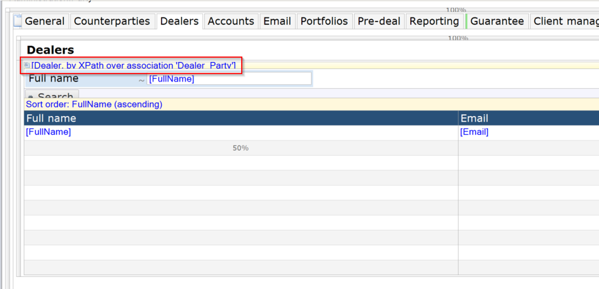
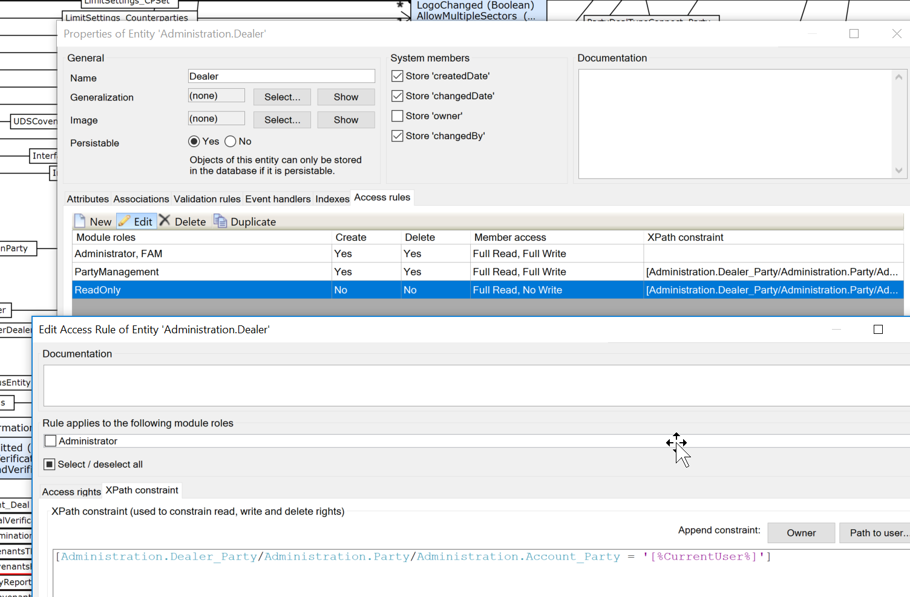

<h1>Checklist</h1>

This document contains a checklist of various important things to notice when developing.

<h2>New objects</h2>

<ul>
  <li>Is object in correct module?</li>
  <li>Are Read/Write/Delete/Add-permissions associated with correct user roles?</li>
  <li>Are all necessary user roles define</li>
  <li>Check ‘when deleting object A, also delete object B’ association</li>  
  <li>Is object used in My companies? If so don't forget to include it in the static data setup</li>  
</ul>

<h2>Date attributes</h2>
<ul>
  <li>Check localize/non localize option.</li>
  <li>Always use the ‘UTC’-variant of date-tokens (e.g. use %BeginOfCurrentDateUTC% and not %BeginOfCurrentDate%) and date-functions (e.g. use formatDateTimeUTC() and not formatDateTime()). </li>
  <li>Especially when a date is used logically (e.g. one of the usages of OriginalRollDate in Cashflow is that it is compared to the DealDate in Deal, thus Cashflow/OriginalRollDate and Deal/DealDate are both used logically) always be sure that the date is trimmed to days. Because normally when we compare dates to each other we are not interested in the exact time. For example, let’s say we haven’t trimmed both the DealDate and OriginalRollDate: DealDate = 5/6/2015 12:25 and OriginalRollDate = 5/6/2015 12:45. When I want to check if OriginalRollDate is equal to the DealDate the above should result in true. However, when I don’t trim the dates to date, the above obviously result in false.</li>
  <li>When adding dates to templates in the integration settings, always use the the format date function, with format ‘dd-MM-yyyy’. In the associated excel, create a column with the date as a date, and a different column with the function TEXT(DateColumn;’dd-MM-yyyy’). The integration settings should refer to the latter column. </li>  
</ul>

<h2>Boolean attributes</h2>

<ul>
  <li>When using a boolean-attribute, make sure the object containing the boolean actually exist. Trying to do anything with a boolean-attribute with an empty object always result in an error, because a boolean cannot be empty.</li>
</ul>

<h2>Decimal attributes</h2>

<ul>
  <li>Is the new value related to a certain currency? If so, use the RoundAmount-microflow to round amounts if needed.
This is needed for reporting purposes (end users don’t want a value of EUR 2.500,1823, but simply EUR 2.500,18), but also calculating purposes. Say we have two not rounded EUR settle amounts, 100,459 and 100,255. When taking the sum of these amounts we we’ll receive 200,714. If we round the amount at this point we get the result 200,71. This is incorrect, simply because amounts 100,459 and 100,255 are invalid amounts in EUR. The result should be 100,46 + 100,26 = 200,72</li>
  <li>Normally amounts should be grouped by digits in forms and columns.</li>
</ul>

<h2>String attributes</h2>

<ul>
  <li>Try to figure out the necessary length of a string-attribute. You can leave it at the default 200-characters, but this is not always the right way: for example the currency-code is never bigger than 3 characters, so it is actually unnecessary to make this bigger than 3 characters. More important however is the other way around: when trying to copy strings from one attribute to another which exceeds the limit set to the attribute will result in an error.
Attributes in general</li>
  <li>Doing anything logically or reformatting an attribute in a microflow should always be tested whether the attribute is empty or not. Of course, when you are certain that the attribute is  never empty you can omit this.</li>
  <li>Never use the deprecated attribute-types.</li>
</ul>

<h2>Buttons</h2>

<ul>
  <li>Delete dutch language when creating new buttons</li>
  <li>Add icon to new buttons. Use the same icon for buttons with the same functionality</li>
  <li>Check whether it is needed to make the button asynchronical + progress bar.</li>
</ul>

<h2>Microflows/Forms</h2>

<ul>
  <li>Are there processes/forms created that are nearly identical? Find out if replacing these processes with one microflow/form is a solution.</li>
  <li>Does the microflow/form have the correct roles assigned? This is especially important for microflows that are run automatically when a form or grid is shown on screen. The reason why this is even more important, is because the modeler does not check whether you have assigned the correct roles for these microflows. When a user opens a form and does not have the necessary user roles it will result in a Mendix-error. The same goes for onchanges.</li>
  <li>Are the microflows/form created in the right module? Especially, user role wise this is important.</li>
  <li>For more complex microflows or work arounds, please use annotations. Otherwise, after a while no one really knows the logic anymore of a microflow.</li>  
  <li>Are there unnecessary elements in the microflows created/adjusted? (Think of actions that are never used or flows that don’t seem logical)</li>  
  <li>Did you clean the project of test-software? Check out unnecessary onchanges, microflows that are never used, microflows and forms still only associated with Administrator…</li>  
  <li>When adjusting a microflow/association/attribute of an object did you check the ‘find all usages’ of the mentioned element? An adjustment might influence other software.</li>    
</ul>

<h2>Process related</h2>

<ul>
  <li>Release notes updated?</li>
  <li>Did you create a test document? Did you tested enough scenarios based on the risk-value of the project?</li>
  <li>Did you update the Sprintr that the project is finished and tested?</li>
  <li>Did you do something that need migration? (update release notes)</li>  
  <li>Did you adjust objects (new, adjusted or deleted) which were/will be used in templates? Update the release notes that the integration settings should be synced after deploy.
Conflicts</li>  
  <li>If possible, please consult with others when conflicts show up that you don’t recognize. </li>  
</ul>

<h2>Security</h2>

<ul>
<li>
Every object that is visible in a form and that is retrieved by Xpath should be secured on domain-level. The reason of this extra layer is because a technically skilled user can actually view this Xpath in the browser and can actually manipulate this path, and potentially can fetch data which is not visible on screen.

The rule is that a user can only see data from companies that its associated with (via association Account_Party). 

Example:

In the above example the Dealer is accessible via form, via the Xpath Dealer_Party.
This Xpath can be removed on the back end, enabling an end-user to see all the Dealer-object that is in the TM-database. 

Therefore an Xpath should be added in the object itself for all user roles except for FAM and Administrator:

This Xpath makes sure that even though an Xpath is not set on the form (or gets removed by an end user) the end user will only see the Dealer-records that are linked to Companies that this person has access to.
</li>
</ul>

